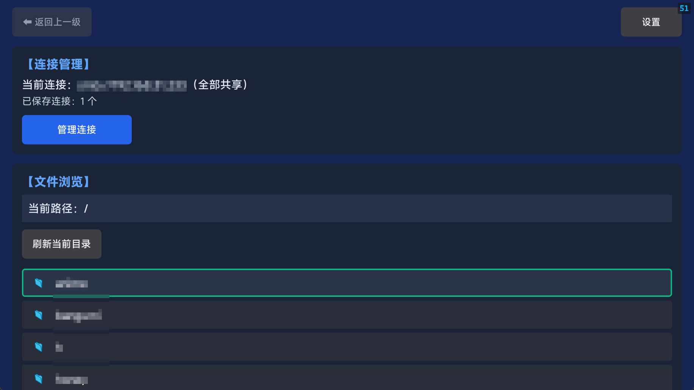
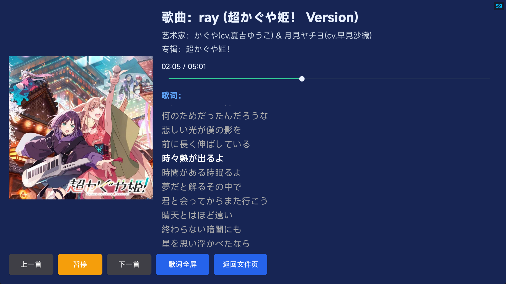

#  TSM Player

> TV SMB Music Player
> 
> 一款专为 Android TV 设计的媒体播放器，支持通过 SMB 协议播放局域网共享媒体文件。


## 📖 项目由来及碎碎念

最初只是想在 TCL 55Q9L Pro 这款电视上听 NAS 上的 DLsite 音声或歌曲，同时能够正常显示歌词和封面。

但是，在尝试了系统自带的文件管理器及 10 多款第三方应用后，均未能很好的解决此需求。

碰壁包括但不限于：

- 播放器无法正常显示歌曲 / 图片
- 播放器无法访问 SMB 存储
- 播放器不符合现代 TV 交互（方向键 + 返回）
- 播放器显示中文字体乱码或方块
- 无法侧载方式安装或安装报错
- ~~收费~~

因为找软件再一个个安装也花费了大量时间（也用了几个小时），索性梳理了下核心诉求，花了 4 小时左右 Vibe 了这款应用，希望能帮到有同样需求的人。

同时也不由感慨 AI 的进步，我本身并没有任何安卓开发经验，反倒是和 AI 的对话过程中学到了不少。后面也陆陆续续打磨优化了应用的不少细节。后续更多也会优先以个人需求为导向迭代，望热心 issues 党谅解。

## 🖼️ 界面预览

### 主界面


## ✨ 特性

- 🖥️ 专为 Android TV 优化的 Leanback 界面
- 📁 支持 SMB 协议浏览和播放局域网共享文件
- 🎵 支持音频播放，包含歌词显示
- 🎬 支持视频播放
- Ⓜ️ 内嵌 [MiSans](https://hyperos.mi.com/font/) 字体，保障中文显示 ~~（谢谢雷总）~~
- 📱 同时支持 TV 和手机/平板（但是交互全部优先 TV 端）

## 📱 安装

1. 从 [Releases](../../releases) 页面下载最新的 APK 文件
2. 将 APK 文件传输到 Android TV 设备或使用 ADB 安装
3. 安装并运行

## 🚀 快速开始

### 连接 SMB 共享

1. 打开应用，进入设置
2. 添加 SMB 服务器配置
3. 输入服务器地址、用户名和密码
4. 浏览并播放媒体文件

### 播放界面


## 🔧 构建

详细的构建说明、环境要求和常用命令请参考 [docs/MANUAL.md](./docs/MANUAL.md)

```powershell
# 克隆仓库
git clone https://github.com/gbandszxc/tsm-player.git
cd tsm-player

# 构建 Debug 版本
.\gradlew.bat assembleDebug

# 构建 Release 版本
.\gradlew.bat assembleRelease
```


