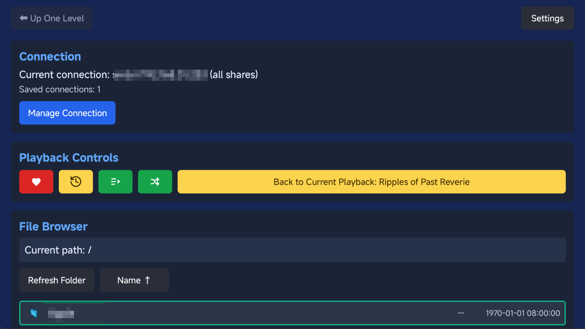
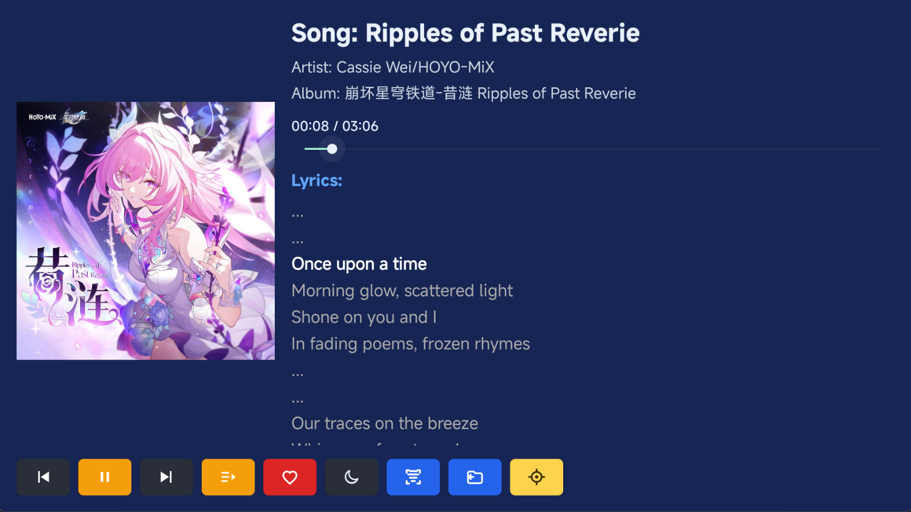

**[中文](../README.md)** | English

#  TSM Player

> TV SMB Music Player
>
> A media player designed for Android TV that plays media files shared over your local network via the SMB protocol.


## 📖 Backstory & Ramblings

It all started because I wanted to listen to DLsite voice works and songs stored on my NAS through my TCL 55Q9L Pro TV — with proper lyrics and cover art display.

After trying the built-in file manager and more than 10 third-party apps, none of them really solved the problem.

The frustrations included but were not limited to:

- Players that couldn't display song titles or cover art properly
- Players that couldn't access SMB storage
- Players that didn't follow modern TV interaction patterns (D-pad + Back)
- Players showing garbled text or tofu blocks for Chinese characters
- Apps that couldn't be sideloaded or crashed on install
- ~~Paid apps~~

Since I'd already spent hours searching and installing apps one by one, I figured I might as well outline my core requirements and vibe-coded this app in about 4 hours. Hopefully it helps others with the same needs.

I'm also genuinely amazed by how far AI has come — I had zero Android development experience, yet I learned a lot just through conversations with AI. Since then I've been polishing and refining various details of the app. Going forward, I'll prioritize features based on my own needs, so I appreciate the understanding of enthusiastic issue filers.

## 🖼️ Screenshots

### Home Screen



## ✨ Features

- 🖥️ Leanback UI optimized for Android TV
- 📁 Browse and play LAN shared files via SMB protocol
- 🎵 Audio playback with lyrics display
- 🎬 Video playback support
- Ⓜ️ Bundled [MiSans](https://hyperos.mi.com/font/) font for proper CJK rendering ~~(thanks, Lei Jun)~~
- 📱 Works on both TV and phones/tablets (but interaction is TV-first)

## 📱 Installation

1. Download the latest APK from the [Releases](../../releases) page
2. Transfer the APK to your Android TV device or install via ADB
3. Install and launch

## 🚀 Quick Start

### Connecting to an SMB Share

1. Open the app and go to Settings
2. Add an SMB server configuration
3. Enter the server address, username, and password
4. Browse and play your media files

### Quick Locate Mode

When the file list is long, you don't need to hold down the remote's D-pad to scroll:

1. Focus on any file item in the file browser
2. Long-press the OK button to enter "Quick Locate Mode"
3. Release OK once you see the temporary ratio bar and percentage indicator in the bottom-right corner
4. Use `↑/↓` to jump by full screens, use `←/→` to jump in `10%` increments of the total list length
5. Press OK to accept the position and exit the mode, or press Back to cancel

Directory-level focus anchors automatically remember your last browsed position. When you revisit the same directory, the app restores focus to the item you were on. Running "Clear Cache" in Settings will also reset these browse anchors.

### Playback Screen



## 🔧 Building

```powershell
# Clone the repository
git clone https://github.com/gbandszxc/tsm-player.git
cd tsm-player

# Build Debug version
.\gradlew.bat assembleDebug

# Build Release version
.\gradlew.bat assembleRelease
```

